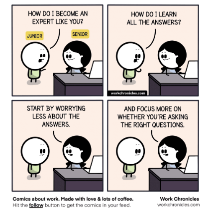

## Their Question Gets An *A+*
I was tasked with visiting Stack Overflow, a Q&A website for programmers, to expand my knowledge on both smart and dumb questions, both of which are in abundance on the website. One example I found of a smart question is by someone who wanted to figure out why, when he changed his code in specific ways, that it would only output 'true' or only output 'false'.

---

```
Q: Check if a string is composed of all unique characters-- not equal to operator in JavaScript

I have written the following code to check if a string is composed of all unique characters

// Source - https://stackoverflow.com/q/42073776
// Posted by CharStar
// Retrieved 2026-06-08, License - CC BY-SA 3.0

    function isUnique(string) {
    var charMap = {};
    for(var i= 0; i < string.length; i++) {
        if (charMap[string[i]] != null) {
            charMap[string[i]] = 1;
            return false;
        } else {
            charMap[string[i]] = 0;
        }
    }
    return true;
}

This works when I run it, however, my linter is recommending I use "!==" rather than "!=" to compare to null.

if I change this line to if (charMap[string[i]] !== null) {, The code stops working and returns false regardless.

If I change this line to if (charMap[string[i]]) { (which I think should be the same), the function returns true regardless.

Can someone please give a plain text explanation of the differences between these three? I may be making a silly mistake in thinking they are similar so please bear with me.
```
---

To me, this response seems decently smart. First of all, they start with a “object - deviation” heading format, where “object” specifies what is having a problem, and the “deviation” part describes the deviation from expected behavior. They also provide what code they have which is better than providing nothing for others to work with, and leading them down a path of needing to ask a million questions. I also noticed how they at least demonstrated that they tried different ways to fix their problem rather than trying to get a free answer, and that they did not directly just ask for the answer, but instead asked to help clear up their misunderstandings instead. Of course, that's not to say there isn't room for improvement, such as a bit of courtesy although not nearly as necessary compared to clarity.

In return for this good question, the user received a very thorough response:

```
There are two values in JavaScript which are very similar to each other: undefined and null.

undefined is the default state of all variables, including the value of unknown properties in an object.

var x;
console.log(x); // undefined

var obj = {
  a: 1
};
console.log(obj.b); // undefined

null is a value you can assign to something. It's generally used to imply that a value is purposefully non-existent.

When doing a weak comparison against null (!= null), it's the equivalent of doing:

x !== null && x !== undefined

By changing your code to

if (charMap[string[i]] !== null) {

you're omitting the check for undefined, which is what you really wanted in the first place.

Next, you tried

if (charMap[string[i]]) {

This checks to see if the value is "truthy". Basically, it translates to:

x !== false && x !== null && x !== undefined && x !== '' && x !== 0

That last clause is what's catching you. You initialize the value to 0 to start with but your code will never catch that.
```

---

As far as I could tell, there were many more detailed answers, and the asker even replied to the person who gave the response above to thank them and praise the thoroughness and clearness of the response. The additional replies also lacked that distinct sarcasm and wit that annoyed hackers often answer a dumb question with. Additionally, since it was about some JavaScript fundamentals, I also found the response to be quite useful.

Here is a <a target="_blank" href = "https://stackoverflow.com/questions/42073776/check-if-a-string-is-composed-of-all-unique-characters-not-equal-to-operator-i">link</a> to the StackOverflow page

## You Failed, But There's Always Next Time
Here we have an example of someone who really didn't even try. He offers little information on what they have a problem with, and just pastes a block of code for those who are even willing to sift through and make out an error. They basically just ask for a straight up answer, which many on the website were not too happy with.

---

```
Q: Creating a recursive method for Palindrome

I am trying to create a Palindrome program using recursion within Java but I am stuck, this is what I have so far:

// Source - https://stackoverflow.com/q/4367260
// Posted by Nightshifterx, modified by community. See post 'Timeline' for change history
// Retrieved 2026-06-08, License - CC BY-SA 3.0

 public static void main (String[] args){
 System.out.println(isPalindrome("noon"));
 System.out.println(isPalindrome("Madam I'm Adam"));
 System.out.println(isPalindrome("A man, a plan, a canal, Panama"));
 System.out.println(isPalindrome("A Toyota"));
 System.out.println(isPalindrome("Not a Palindrome"));
 System.out.println(isPalindrome("asdfghfdsa"));
}

public static boolean isPalindrome(String in){
 if(in.equals(" ") || in.length() == 1 ) return true;
 in= in.toUpperCase();
 if(Character.isLetter(in.charAt(0))
}

public static boolean isPalindromeHelper(String in){
 if(in.equals("") || in.length()==1){
  return true;
  }
 }
}

Can anyone supply a solution to my problem?
```
---

For starters, as a comment I read pointed out, the user does not even have *any* recursion in their code block. To give them the benefit of the doubt, perhaps they are new to programming, but it seems more like an indicator that they did not do any research prior, and are just looking for a quick answer.

Luckily for them someone copy-pasted an answer from somewhere on the web, but that really defeats the purpose of asking specific questions to try and learn what you need to rather than just being handed the answer. It does not promote thinking or discussion in the community, and so overall, it does not really benefit anyone in a meaningful way outside of getting the needed answer.

Here is the <a target = "_blank" href = "https://stackoverflow.com/questions/4367260/creating-a-recursive-method-for-palindrome">link</a> to the StackOverflow page

## Final Thoughts
So, after reading this, asking smart questions may seem like quite a daunting task. To be honest, I would have to agree. Even a single mistake can end up with you ignored or mocked, but I feel there is still a decent bit of common sense when it comes to asking these questions than it seems. The other parts that are not so obvious can hopefully be learned through time and experience, and perhaps one day the asker might be the one giving the answer instead.

## Conclusion
I think both of the questions, good and bad, helped me gain some insights into the importance of asking smart questions. I can see now that it is just good practice to provide as much as you can to catch people up to speed on what you need help with. Not only does it help you to receive more interest in your question, but also helps the viewer to pick up on your problems faster. As they say, "help me help you". I also see the importance of doing research beforehand. This ties into the idea of being able to provide as much info as you can, but you may even be able to find a solution on your own. On top of that, you have less of a chance of making a fool of yourself on a public forum, and show that you at least put in the effort, regardless of the outcome. And lastly, it is a great way to just improve your knowledge. Asking specific and educated questions allows you to, once again, possibly receive responses faster, but also to further build upon what knowledge you already have, which is never a bad thing. That is just a few of the many benefits of asking smart questions that I can think of, but when asking smart questions, you can expect smart responses at the very least.
