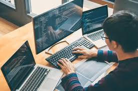

## Introduction

## Estimating My Efforts
When making my estimates they were based on my best guesses. One way I informed my estimate was how long it took me to do my WODs related to my current task, such as editing navbars, making style changes, and so on. Generally, I felt I was able to catch on to these WODs fairly quickly, so my estimates were a bit lower for things related to style. However, for most WODs I would often give myself a very high estimate (which would almost always end up being right) on how long it would take because I did not feel as though I was sufficiently knowledgeable enough. I applied the same principle for my tasks, especially for ones that I felt carried much more difficulty than others. For the tasks that required me to work with Prisma, for example, I was not so naive to think that it would take me only an hour to complete, especially because a lot of the aspects of that task were not covered in the WODs, such as getting user confirmation before deleting something, or trying to work with NextAuth user sessions to keep track of their id, name, etc.

## Reaping The Benefits Of Effort Estimation
In my case, I was usually cautious, and so I would give myself plenty of time to finish my assigned tasks because I knew my teammates were relying on me to do my part. Therefore, estimating in advance did not really provide as much benefit. However, that is not to say that there is no benefit at all.

In the case of someone who is not cautious, it might spur them on to start their work a bit earlier than normal. In the case of someone stressed by all the tasks ahead, then an estimation of the time needed might reveal that they have less to be worried about than they thought.

## Keep Track Of Actual Effort, Get Actual Benefits
I believe that keeping track of my actual effort was useful. For example, a lot of my tasks were to work on the style of our website, so it was helpful to use my past tasks to inform my future ones. Also, even if I did usually start my tasks with ample time left to finish them before out milestone due dates, I think it made me less stressed about the task overall. For my first task I underestimated the time it would take to finish creating the style of some pages, and so it taught me not to underestimate the complexity of HTML, CSS, and React Bootstrap even though I felt comfortable using them beforehand. I also believe it may have helped my teammates to assign tasks more appropriate for me based on how long my previous ones took me.

## Taking My Time
The way I tracked my actual efforts was also through my best guesses. I would usually just try my best to keep track of when I started a task, and when I stopped working. I think the way I worked went in my favor, because I would often do my work in big chunks until I finally reached a good stopping point&mdash;usually when my local test development page showed what I wanted with no errors&mdash;so, there was not many breaks and other things to try and account for. Because of this, I think my estimates were accurate enough, especially because they generally agreed with AI's estimate of my actual effort.

## Improving My Efforts Toward Estimating
In terms of my estimation and tracking of actual effort, I would definitely incorporate more specialized tools for both the next time I work on a project. Even while only using my best guesses, I can still see the benefits that effort estimation and tracking brings. I would probably use AI to create initial estimates of the tasks I need to complete, and I would keep track of my actual effort using a tool like WakaTime, or maybe the GitHub CoPilot timer in VSCode, for starters.

## The Assistance Of AI
As mentioned above, I did use AI

since I used AI to help me with my tasks,
after I was done with each, I could get its best estimation on how much actual effort it required of me
such as template from WODs, and some parts of my teammate's design that I could use for consistent styling across all the pages

## Conclusion

