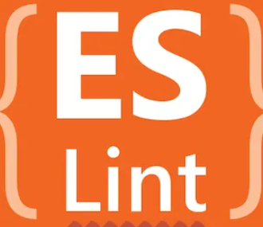

## More Than Just Forgetting A Semicolon
Even in the sense of simple coding standards, such as semicolons or where you place curly braces, they can be quite important. They are the baseline for creating readable, and easily understandable code that follows these common coding standards. It can only benefit you and others as programmers to have this kind of easy-to-look-at code. All this to say, coding standards, including the minutia, are integral to creating quality code. However, after using ESLint, I now understand that there are much more involved ways of standardizing code. 

When working on an assignment to apply ESLint coding standards to an intentionally unstandardized TypeScript file, a few that stood out to me was the suggestion to use dot (.) notation for objects over bracket ([]) notation to access their properties' values, or to use array literal notation instead of using the *new* operator. Having some of these coding standards can definitely help many to learn a language first of all, by reducing the time it takes to have to understand a piece of code. I think it also allows them to pick up on patterns that many of the language's features share as opposed to having to go based entirely on another programmer's coding style.

## A Week Of ESLint
To be honest, I haven't really noticed much of ESLint while I'm working in VSCode so far. Whether that's because I'm doing a good job of following coding standards, or my code just simply isn't long or advanced enough to make mistakes to anger ESLint (I suspect it's the latter), I haven't witnessed too many red squiggly underlines yet. However, that does not mean I find having installed ESLint pointless. As I mentioned above, I know that it is a very useful and convenient tool. Like I also mentioned above, during my homework to apply ESLint coding standards to an intentionally unstandardized TypeScript file I experienced firsthand ESLint's usefulness, and I'm sure in the future when I do end up making lots of mistakes, ESLint will be more than happy to warn me, much to my benefit.

## Final Thoughts And Conclusion
While I admit I have been endlessly praising ESLint thus far, there are still some doubts in my mind. I have seen other perspectives and even thought about it a bit myself, but having these coding standards mean you have to get it exactly right. In my case, I haven't had much issue since my code is nowhere near large or complicated enough, but I do worry that if I eventually end up at that point, that an ESLint error will be the last thing I can't figure out and frustrate me to no end. But, overall, I understand the importance of having coding standards, and I look forward to the usefulness ESLint will bring, while hopefully proving that my worries were unfounded.
