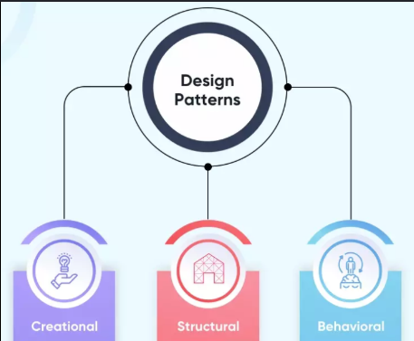

## You Can Just Copy-And-Paste, Right?... Wrong.
As a whole, the idea of Software Engineering is still quite new to me. ICS 314 is my first experience with anything of the sort. Therefore, my understanding of design patterns is quite limited as well, much more so than other topics covered in the class so far. However, if there is one thing I am sure of, it is that design patterns are not something you just copy and paste into your code. It does not have a strict or precise format, but is instead more of an idea that can be executed in many ways to solve a problem.

## Plumbing Up With Analogies For Design Patterns
Now, if you are anything like me, then this will be a difficult concept to grasp, so perhaps it is better to think about it like plumbing for a house...

Suppose that you want flowing water to all your plumbing fixtures (sink, toilet, shower/bath, etc.). There is not just one set way to establish pipe lines to each fixture; lots of houses have different structures, interiors, and so on. Your local hardware store does not sell pre-built "one size fits all" pipe layouts, because they do not exist. More generally, a single-story house will more than likely not have the same pipe pattern as a two story house, or a three story apartment. And yet despite the differences in layout, the best practice of potential problems remains the same

The foremost problem of plumbing is even getting water to the fixtures. If you had an individual pipe for every fixture, it would not be very good for your house. The best practice in this case is to find some way to give each house only one central, main water supply entryway. The idea remains the same, but the execution may be different depending on various factors such as location.

Another important problem is getting clean water to use. The best practice here is obviously to run it through several filters, with each building off the previous filter. While the design pattern of using filters for dirty water remains the same, how it is executed can differ.

## From Plumbing to Programming
Now that I have shared some analogies for design patterns via plumbing, I will try to relate those to some I have used in my final project for ICS 314.

In terms of a central, main water supply entryway, my team and I use a single Prisma connection to our database. Creating a connection for each page that needs to access some part of the database would eventually make too many for it to handle. Thus, the design pattern of having only a single connection is useful here, and executed with Prisma.

In terms of the water filter, I need data associated with a user to be usable in the current session, so I first need to "filter" it through `authorize()` to validate the user's credentials. Then, I "filter" it through `jwt()` to encrypt it in tokens. Finally, `session()` "filters out whatever data came from `jwt()` that is not safe to be displayed on the frontend.

## Final Thoughts
Design patterns are nothing like UI frameworks despite initially thinking so. Design patterns are a lot more flexible, and I see that it is used for backend development such as databases, connections, etc. and not so much for the frontend compared to UI components.

*Use of Google Gemini 3.6 Flash Extended to assist in creation of analogies*

