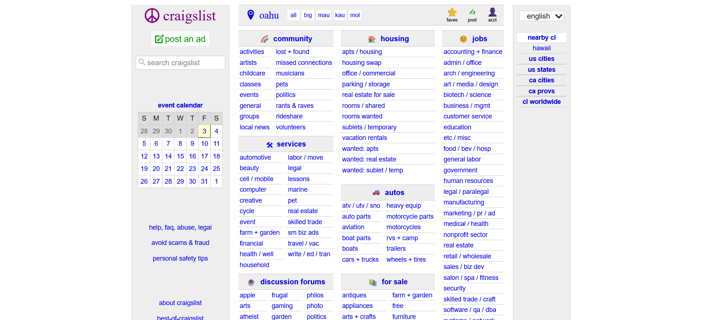

## How Was Bootstrap?
From my experience with Bootstrap, it can be quite challening to get a grasp of, much like learning a new language. There is so many components that you have access to, and it has its own syntax for implementing it into your HTML that can differ quite a bit from the CSS that many may be used to. On top of that, every tag seems to want to be nested inside each other, especially for navbars with dropdown menus where you need to make an unordered list, not to mention all the other content that goes inside which may also need to be nested.

## So, Why Bother With Bootstrap?
Despite the significant learning curve that it has, Bootstrap provides a much cleaner and quick way to implement UI components into your project, provided you are willing to put in the time and effort to understand it. In theory, you could use only raw HTML and CSS, but that would mean building everything from scratch yourself. In that case, you may end up with a stylesheet hundreds of lines long for just one or two components, whereas Bootstrap gives these to you pre-built. That does not mean, however, that you are locked in to whatever the Bootstrap gods have designed for you. Following the "CSS Box Model", there are many ways to change individual margins, padding, and more including positioning. And if even that is not enough, you are more than welcome to apply your own CSS to Bootstrap components.

<em>Website Without a UI Framework</em>

<em>Website With a UI Framework</em>

## Conclusion and Final Thoughts
I think this is very useful in terms of software engineering because it saves time. I think most people would agree that they would rather have something trustowrthy and pre-built rather than needing to waster their time making it all from scratch. So, overall, despite the leaning curve and frustration that Bootstrap may initially bring, once you get the hang of it you will be giving yourself a much easier time when creating websites.
