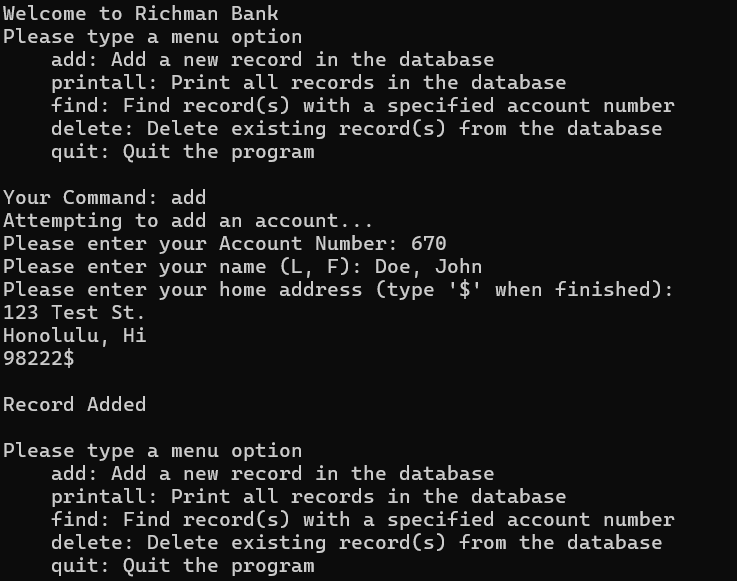

For my final project in ICS 212 I was tasked with creating a bank UI using C and C++ entirely on UH Unix. It had to allow the user to add, find, delete, or print all accounts. On top of that, their information had to be saved even when they exited the program. It also had to be able to account for user error, such as entering in an invalid command or invalid information, such as a negative integer. 

To do this I had to use my knowledge of addresses, pointers, the stack and heap, reading and writing to files, and  much more. I was able to learn a lot about critical thinking, especially because the project encapsulated pretty much everything we had learned up until that point, and so I needed to be very specific in what exactly I wanted my program to do, and how I would get it to do so. It also really helped me think about the bigger picture, such as where addresses pointed to, how to deal with delting them while preserving a path to other addresses, and how the stack and heap interact with everything on a hidden level.

Overall, it culminated into a very satisfying project where I truly felt I understood how everyting worked and where I was able to put my full knowledge of C and C++ on display.
